# InEx_System v2.0 UI 细节调整与人性化优化方案

## 一、概述

基于对项目 UI 层代码（`ui/` 目录，共 19 个文件）的全面审查，当前 UI 已具备良好的基础架构（集中式 [`UIStyles`](ui/styles.py) 样式管理、Toast 通知组件、错误处理工具等），但存在以下可优化方向。本方案共分 **8 大类、21 项具体调整**，按优先级排列。

---

## 二、详细优化项

### P0 - 关键体验问题（影响核心操作流）

#### 1. 侧边栏折叠交互优化

| 项目 | 当前状态 | 优化建议 |
|------|---------|---------|
| **文件** | [`main_window.py`](ui/main_window.py:917) `toggle_sidebar()` | |
| **问题** | 折叠后宽度 60px 仍显示完整文字，文字被截断；展开后跳变到 280px 与原宽度 200px 不一致 | |
| **方案** | 折叠模式只显示 Emoji 图标 + 鼠标悬停显示 Tooltip 文字；保留展开 200px 宽度；添加 `QPropertyAnimation` 平滑过渡动画 | |

#### 2. 登录页与主应用字体不一致

| 项目 | 当前状态 | 优化建议 |
|------|---------|---------|
| **文件** | [`login_dialog.py`](ui/login_dialog.py:92) vs [`styles.py`](ui/styles.py:60) | |
| **问题** | 登录页使用 `"Microsoft YaHei"`（硬编码），主应用使用 `"微软雅黑"`（`UIStyles.FONT_FAMILY`），在非 Windows 系统可能出现字体缺失 | |
| **方案** | 登录页所有字体引用改为 `UIStyles.FONT_FAMILY`；登录页输入框样式改用 [`UIStyles.input_style()`](ui/styles.py:596) 统一管理 | |

#### 3. 深色主题完善

| 项目 | 当前状态 | 优化建议 |
|------|---------|---------|
| **文件** | [`main_window.py`](ui/main_window.py:875) `change_theme()` | |
| **问题** | 深色主题仅修改了 `QMainWindow` 和 `QListWidget`，其他组件（表格、输入框、卡片等）仍是浅色，切换后视觉破碎 | |
| **方案** | 在 [`UIStyles`](ui/styles.py) 中定义完整的 `DARK_THEME` 常量组，包括深色背景、深色卡片、反色文字；为所有组件工厂方法提供 `is_dark` 参数 | |

#### 4. 首页核心数据卡片悬停状态不统一

| 项目 | 当前状态 | 优化建议 |
|------|---------|---------|
| **文件** | [`home_page.py`](ui/pages/home_page.py:158) `create_modern_card()` | |
| **问题** | hover 时背景变为白色但左边框保持原色，四个卡片 hover 行为一致但缺少微动效（如微上浮） | |
| **方案** | hover 时添加 `margin-top: -2px` + `box-shadow` 微上浮效果；数值字体加大 2px 并添加过渡动画 | |

---

### P1 - 视觉一致性（跨页面统一）

#### 5. Tab 标签页样式不统一

| 项目 | 当前状态 | 优化建议 |
|------|---------|---------|
| **文件** | [`styles.py`](ui/styles.py:146) `TAB_WIDGET` vs [`styles.py`](ui/styles.py:370) `tab_style_modern()` | |
| **问题** | 存在两套 Tab 样式模板，部分页面使用不同模板，视觉不一致 | |
| **方案** | 统一为 `tab_style_modern()` 一套模板；移除 `TAB_WIDGET` 旧模板引用 | |

#### 6. 筛选栏样式统一

| 项目 | 当前状态 | 优化建议 |
|------|---------|---------|
| **文件** | 各页面筛选栏（`income_page.py:47`, `expense_page.py:48`, `cash_flow_page.py:42`） | |
| **问题** | 收入/支出页使用硬编码 `"background-color: #f8f9fa"`，流水账页使用 [`UIStyles.gray_background()`](ui/styles.py:625)，不统一 | |
| **方案** | 全部改用 `UIStyles.search_frame_style()` 或统一为 `UIStyles.gray_background()` | |

#### 7. 页面头部标题样式统一

| 项目 | 当前状态 | 优化建议 |
|------|---------|---------|
| **文件** | 各页面标题定义 | |
| **问题** | 部分页面标题用 `font-size: 18px`（如收入页），部分用 `16px`（月报表页），部分用 `UIStyles.FONT_SIZE_TITLE`（个人中心），无统一规范 | |
| **方案** | 所有页面标题统一使用 `UIStyles.FONT_SIZE_XXLARGE(16px)` 并加粗；副标题使用 `UIStyles.FONT_SIZE_MEDIUM(11px)` + `TEXT_SECONDARY` 色 | |

---

### P2 - 操作人性化提升

#### 8. 空状态引导

| 项目 | 当前状态 | 优化建议 |
|------|---------|---------|
| **文件** | 各表格页面 | |
| **问题** | 数据为空时表格显示空白，无引导文案或插图 | |
| **方案** | 添加统一的空状态组件（含 SVG 插图/Emoji 图标 + 引导文字 + 操作按钮），如 "暂无数据，点击「新增记录」开始记账" | |

#### 9. 搜索功能增强

| 项目 | 当前状态 | 优化建议 |
|------|---------|---------|
| **文件** | [`global_search_dialog.py`](ui/dialogs/global_search_dialog.py) | |
| **问题** | 全局搜索已有较好实现，但搜索结果列表缺少高亮关键词、预览上下文、快速跳转功能 | |
| **方案** | 搜索结果中高亮匹配关键词；每条结果显示前后文片段；双击结果条目直接跳转到源页面并定位到该记录 | |

#### 10. 输入友好性提升

| 项目 | 当前状态 | 优化建议 |
|------|---------|---------|
| **文件** | 所有含输入表单的页面 | |
| **问题** | 输入框验证错误仅有弹窗提示，缺乏行内即时视觉反馈（红框/错误图标） | |
| **方案** | 利用 [`form_validator.py`](utils/form_validator.py) 已有验证逻辑，在输入框下方添加红色错误文字提示；输入框边框变为红色 + 抖动动画 | |

#### 11. 预算超支预警视觉强化

| 项目 | 当前状态 | 优化建议 |
|------|---------|---------|
| **文件** | [`home_page.py`](ui/pages/home_page.py) `create_budget_card()` | |
| **问题** | 预算预警以卡片形式展示，但超支时视觉冲击不足，用户容易忽略 | |
| **方案** | 超支时卡片添加红色渐变背景 + 脉冲动画边框；Toast 强提醒 + 声音提示（可选）；支出页顶部显示实时预算进度条（红/黄/绿） | |

#### 12. 快捷操作栏优化

| 项目 | 当前状态 | 优化建议 |
|------|---------|---------|
| **文件** | [`base_record_page.py`](ui/pages/base_record_page.py:128) `toolbar_frame` | |
| **问题** | 工具按钮用分隔线分成 4 组，但按钮样式区分度不够（颜色过多），用户可能困惑 | |
| **方案** | 统一按钮颜色为蓝色（主要操作）、灰色（次要/取消）、绿色（新增）；给按钮添加紧凑的 Tooltip 快捷键提示文字 | |

---

### P3 - 布局与自适应

#### 13. 最小窗口尺寸优化

| 项目 | 当前状态 | 优化建议 |
|------|---------|---------|
| **文件** | [`main_window.py`](ui/main_window.py:59) `setMinimumSize(1600, 900)` | |
| **问题** | 最小尺寸 1600x900 过大，在 1366x768 分辨率笔记本上无法完整显示 | |
| **方案** | 降低至 `1280x720`；筛选栏在空间不足时自动折叠为可展开面板 | |

#### 14. 表格列宽自适应

| 项目 | 当前状态 | 优化建议 |
|------|---------|---------|
| **文件** | 各页面表格组件 | |
| **问题** | 部分表头列宽使用 `ResizeToContents`（流水账页），部分使用 `Stretch`（分类页），窗口缩放时表现不一致 | |
| **方案** | 统一使用 `Stretch` 模式 + 设置最小列宽；允许用户拖动调整列宽；保存列宽配置到 `config` | |

#### 15. 月报表日期范围默认值

| 项目 | 当前状态 | 优化建议 |
|------|---------|---------|
| **文件** | [`cash_flow_page.py`](ui/pages/cash_flow_page.py:55) `QDate(2025, 9, 1)` | |
| **问题** | 硬编码日期范围 "2025-09-01" ~ "2025-12-31"，超过当前时间或用户数据范围将显示空白 | |
| **方案** | 改为动态获取数据表中最小和最大日期作为默认范围；或默认取最近 12 个月 | |

---

### P4 - 动效与微交互

#### 16. 页面切换过渡动画

| 项目 | 当前状态 | 优化建议 |
|------|---------|---------|
| **文件** | [`main_window.py`](ui/main_window.py:531) `on_sidebar_changed()` | |
| **问题** | `QStackedWidget` 页面切换瞬间完成，没有过渡动画，体验生硬 | |
| **方案** | 使用 `QPropertyAnimation` 或自定义淡入/滑动效果（遮盖层 + 透明度动画） | |

#### 17. Toast 增强

| 项目 | 当前状态 | 优化建议 |
|------|---------|---------|
| **文件** | [`toast.py`](ui/widgets/toast.py) | |
| **问题** | Toast 仅为黑色半透明条，缺少类型对应颜色（成功=绿、错误=红、警告=黄）、入场/出场动画 | |
| **方案** | 按类型添加左侧彩色指示条；添加从顶部滑入/滑出的位置动画；支持操作按钮（如"撤销"） | |

---

### P5 - 无障碍与国际化

#### 18. 快捷键提示可见性

| 项目 | 当前状态 | 优化建议 |
|------|---------|---------|
| **文件** | 各页面按钮 | |
| **问题** | 快捷键只在菜单栏和快捷键列表对话框中显示，按钮上无提示 | |
| **方案** | 按钮 Tooltip 中添加快捷键提示（如 "保存修改 (Ctrl+S)"）；状态栏显示当前可用的快捷键提示 | |

#### 19. 色彩无障碍对比度

| 项目 | 当前状态 | 优化建议 |
|------|---------|---------|
| **文件** | [`styles.py`](ui/styles.py) | |
| **问题** | `TEXT_TERTIARY = #6b7280` 和 `TEXT_DISABLED = #9ca3af` 在浅灰背景上对比度不足（WCAG AA 标准要求 4.5:1） | |
| **方案** | 调整 `TEXT_TERTIARY` 为 `#4b5563`；`TEXT_DISABLED` 仅在禁用状态使用；确保所有文字背景对比度 ≥ 4.5:1 | |

---

### P6 - 代码维护性

#### 20. 硬编码值迁移

| 项目 | 当前状态 | 优化建议 |
|------|---------|---------|
| **文件** | 多处 | |
| **问题** | `UIStyles` 已提供完备常量，但许多页面仍使用硬编码颜色/尺寸值 | |
| **方案** | 全局搜索并替换：`#f8f9fa`→`BG_GRAY_50`、`#bdc3c7`→`BORDER_MEDIUM`、`#34495e`→`SIDEBAR_BG` 等 | |

---

## 三、实施路线图

```mermaid
graph TD
    A[P0 关键体验] --> A1[侧边栏折叠优化]
    A --> A2[字体统一]
    A --> A3[深色主题完善]
    A --> A4[卡片悬停动效]
    
    B[P1 视觉一致性] --> B1[Tab样式统一]
    B --> B2[筛选栏样式统一]
    B --> B3[标题规范统一]
    
    C[P2 人性化操作] --> C1[空状态引导]
    C --> C2[搜索增强]
    C --> C3[输入验证反馈]
    C --> C4[预算预警强化]
    C --> C5[快捷栏优化]
    
    D[P3 布局自适应] --> D1[最小窗口尺寸]
    D --> D2[表格列宽自适应]
    D --> D3[日期默认值动态化]
    
    E[P4 动效微交互] --> E1[页面切换动画]
    E --> E2[Toast增强]
    
    F[P5 无障碍] --> F1[快捷键提示]
    F --> F2[色彩对比度]
    
    G[P6 代码维护] --> G1[硬编码迁移]
    
    subgraph 第一阶段
        A1
        A2
        A4
        B1
        B2
        B3
    end
    
    subgraph 第二阶段
        A3
        C1
        C2
        C3
        C4
        C5
    end
    
    subgraph 第三阶段
        D1
        D2
        D3
        E1
        E2
        F1
        F2
        G1
    end
```

---

## 四、预估影响范围

| 优先级 | 优化项 | 涉及文件数 | 影响模块 |
|--------|-------|-----------|---------|
| P0 | 侧边栏折叠 | 1 | `main_window.py` |
| P0 | 字体统一 | 2 | `login_dialog.py`, `styles.py` |
| P0 | 深色主题 | 所有页面 | 全局 |
| P0 | 卡片悬停 | 1 | `home_page.py` |
| P1 | Tab统一 | 2 | `styles.py`, 各Tab页面 |
| P1 | 筛选栏统一 | 3 | `income_page.py`, `expense_page.py`, `cash_flow_page.py` |
| P1 | 标题规范 | 9 | 所有页面 |
| P2 | 空状态 | 8 | 含表格的页面 |
| P2 | 搜索增强 | 1 | `global_search_dialog.py` |
| P2 | 输入反馈 | 2 | `form_validator.py`, 各表单页面 |
| P2 | 预算预警 | 2 | `home_page.py`, `expense_page.py` |
| P2 | 快捷栏 | 1 | `base_record_page.py` |
| P3 | 窗口尺寸 | 1 | `main_window.py` |
| P3 | 表格列宽 | 6 | 含表格的页面 |
| P3 | 日期默认值 | 1 | `cash_flow_page.py` |
| P4 | 页面动画 | 1 | `main_window.py` |
| P4 | Toast增强 | 1 | `toast.py` |
| P5 | 快捷键提示 | 所有 | 全局 |
| P5 | 色彩对比度 | 1 | `styles.py` |
| P6 | 硬编码清理 | 10+ | 全局 |
