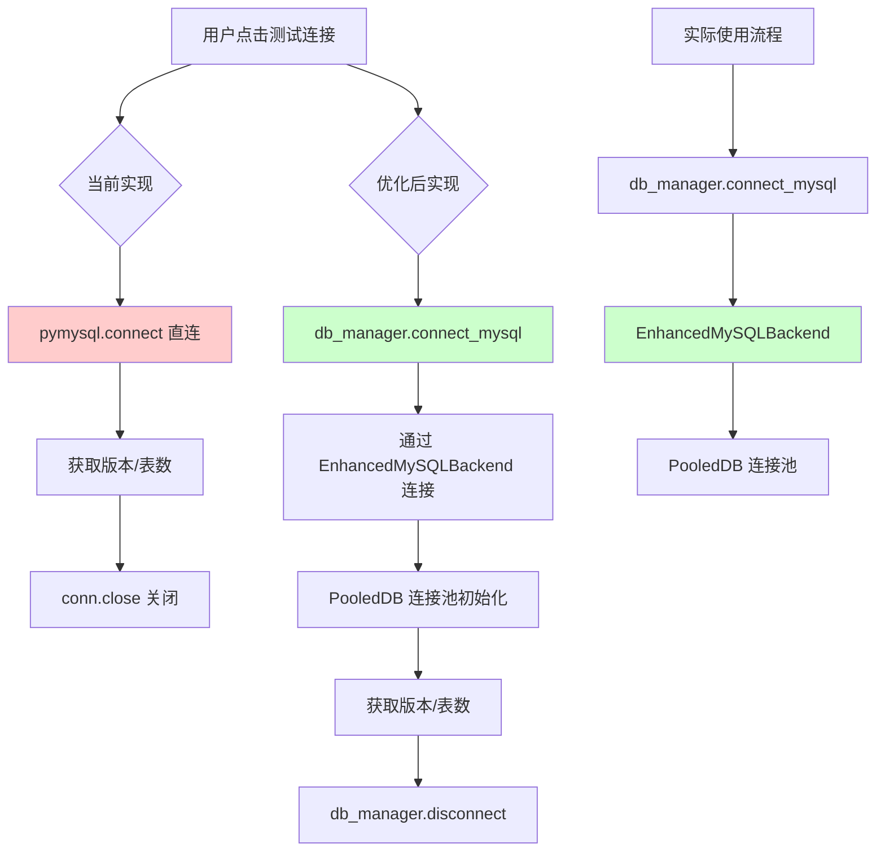
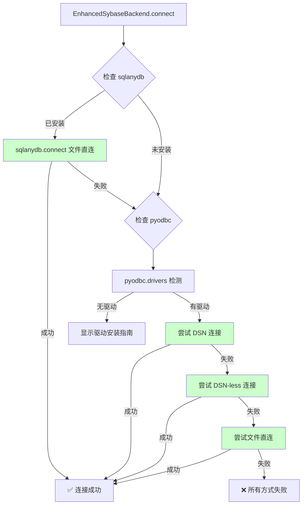
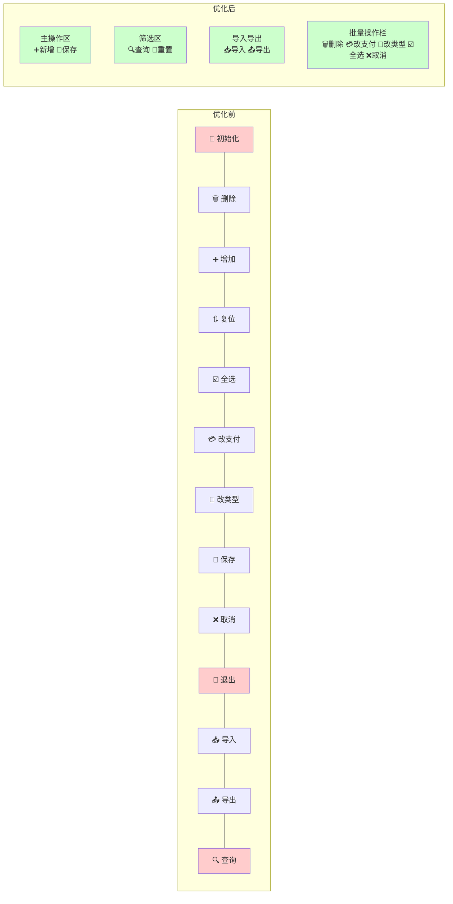

# 收支管理系统 - 数据库连接与前端按钮优化方案

## 一、当前问题分析

### 1.1 MySQL 连接问题

| # | 问题 | 详情 | 严重程度 |
|---|------|------|----------|
| 1 | **连接测试与实际使用不一致** | [`settings_page.test_mysql_connection()`](ui/pages/settings_page.py:465) 使用 **raw `pymysql.connect()`** 直接连接，而 [`EnhancedMySQLBackend`](models/db_backend.py:103) 使用 **PooledDB 连接池**。测试通过≠实际能连 | 🔴 高 |
| 2 | **测试连接缺少连接池验证** | 测试连接创建后立即关闭（`conn.close()`），未验证连接池初始化是否成功 | 🟡 中 |

**差异对比：**

| 维度 | test_mysql_connection (设置页) | EnhancedMySQLBackend (实际使用) |
|------|-------------------------------|--------------------------------|
| 连接方式 | `pymysql.connect()` 直连 | `PooledDB` 连接池 |
| 自动重连 | ❌ 无 | ✅ 3次重试 + 错误码判断 |
| 连接健康检查 | ❌ 无 | ✅ SELECT 1 检测 |
| 空闲超时处理 | ❌ 无 | ✅ 30分钟自动重连 |
| 慢查询监控 | ❌ 无 | ✅ 有 |
| 性能统计 | ❌ 无 | ✅ 查询次数/平均耗时 |

### 1.2 Sybase 连接问题

| # | 问题 | 详情 | 严重程度 |
|---|------|------|----------|
| 1 | **sqlanydb 驱动支持缺失** | [`EnhancedSybaseBackend.connect()`](models/db_backend.py:301) 只支持 pyodbc 的三种方式（DSN/DSN-less/文件直连），但 [`settings_page.test_sybase_connection()`](ui/pages/settings_page.py:541) 和 [`db_connection_dialog._test_sybase()`](ui/dialogs/db_connection_dialog.py:365) 都优先使用 **sqlanydb** | 🔴 高 |
| 2 | **连接测试与实际不一致** | 设置页测试 sqlanydb 成功 → 实际 EnhancedSybaseBackend 使用 pyodbc → 连接方式不同可能导致连接失败 | 🔴 高 |

**差异对比：**

| 维度 | test_sybase_connection (设置页) | EnhancedSybaseBackend (实际使用) |
|------|--------------------------------|----------------------------------|
| 首选驱动 | sqlanydb ✅ | pyodbc ✅ (但sqlanydb❌) |
| 连接方式 | 仅文件直连 (dbf=) | DSN / DSN-less / 文件直连 |
| 配置来源 | db_path 输入框 | params 字典中的 dsn/host/port/db_file |

### 1.3 前端按钮显示问题

**IncomePage - 11 个按钮挤在一行：**

```
🔄 初始化 | 🗑️ 批量删除 | ➕ 增加 | 🔃 复位 | ☑️ 全选 | 💳 改支付 | 📂 改类型 | 🚪 退出 | 📥 导入 | 📤 导出 | 🔍 查询
```

**ExpensePage - 13 个按钮更拥挤：**

```
🔄 初始化 | 🗑️ 删除 | ➕ 增加 | 🔃 复位 | ☑️ 全选 | 💳 改支付 | 📂 改类型 | 💾 保存 | ❌ 取消 | 🚪 退出 | 📥 导入 | 📤 导出 | 🔍 查询
```

| # | 问题 | 详情 |
|---|------|------|
| 1 | **按钮过多无分组** | 11-13 个按钮在一行，无视觉分隔，用户难以快速找到目标操作 |
| 2 | **🔍 查询按钮重复** | 筛选栏已有 "🔍 查询" 按钮，按钮栏重复出现 |
| 3 | **🚪 退出按钮冗余** | 已有侧边栏导航，退出按钮多余 |
| 4 | **🔄 初始化不常用** | 初始化操作非常低频，不应占用主工具栏位置 |
| 5 | **保存/取消状态未分离** | ExpensePage 的保存/取消按钮始终显示，但编辑时才有效 |

**参考：** [`BaseRecordPage`](ui/pages/base_record_page.py:127) 已经实现了良好的 4 组分栏布局，但 IncomePage 和 ExpensePage 未使用该基类。

---

## 二、优化方案

### Part 1: MySQL 连接优化

#### 1.1 统一测试连接使用 EnhancedMySQLBackend

**目标：** `test_mysql_connection()` 通过 `db_manager.connect_mysql()` 进行测试，而非 raw pymysql

**修改文件：** [`ui/pages/settings_page.py`](ui/pages/settings_page.py)

**具体改动：**

```python
# 修改前 (line 486-498):
try:
    import pymysql
    conn = pymysql.connect(
        host=host, port=int(port), user=user,
        password=password, database=database,
        charset='utf8mb4', connect_timeout=5
    )
    # ... 获取信息后立即 conn.close()

# 修改后:
try:
    from models.db_backend import db_manager
    db_manager.connect_mysql(
        host=host, port=int(port), user=user,
        password=password, database=database
    )
    # 通过 db_manager._backend 获取版本、表数量等信息
    # 测试完成后 disconnect()
```

**优势：**
- 测试连接与实际使用的代码路径完全一致 ✅
- 自动验证连接池初始化 ✅
- 后续维护只需要维护 EnhancedMySQLBackend 一处 ✅

#### 1.2 配置传递优化

**问题：** [`save_all_settings()`](ui/pages/settings_page.py:1341) 将 MySQL 参数以扁平方式传递给 `config.set_database_config()`，但 [`EnhancedDataManager.connect_mysql()`](models/db_backend.py:754) 以独立参数接收这些值。

**现状：** 参数已在 [`config.json`](config.json:2-15) 的 `database` 节点下正确存储，且 [`load_settings()`](ui/pages/settings_page.py:72) 已正确加载到 UI 控件中，所以 **此部分当前无问题**，保持现有机制即可。

---

### Part 2: Sybase 连接优化

#### 2.1 EnhancedSybaseBackend 增加 sqlanydb 支持

**目标：** 让 [`EnhancedSybaseBackend.connect()`](models/db_backend.py:301) 优先尝试 sqlanydb 驱动（与测试对话框一致）

**修改文件：** [`models/db_backend.py`](models/db_backend.py)

**具体改动：**

```python
# 在 connect() 方法的 connection_methods 列表开头增加 sqlanydb 方式
def connect(self, **params):
    # 步骤1: 先尝试 sqlanydb (快速文件连接)
    try:
        import sqlanydb
        db_file = params.get('db_file', '')
        if db_file and os.path.exists(db_file):
            self.conn = sqlanydb.connect(dbf=db_file, uid='DBA', pwd='sql')
            self.cursor = self.conn.cursor()
            logger.info("[Sybase] sqlanydb 连接成功")
            return True
    except ImportError:
        logger.debug("[Sybase] sqlanydb 未安装，尝试 pyodbc...")
    except Exception as e:
        logger.warning(f"[Sybase] sqlanydb 连接失败: {e}")

    # 步骤2: 尝试 pyodbc (原有三种方式)
    # ... 原有逻辑不变
```

同时增加一个 `_connect_via_sqlanydb()` 方法，与现有的 `_connect_via_dsn()`/`_connect_via_dsnless()`/`_connect_via_file()` 并列。

#### 2.2 统一 test_sybase_connection 与 EnhancedSybaseBackend

**目标：** `test_sybase_connection()` 使用 `db_manager.connect_sybase()` 进行测试

**修改文件：** [`ui/pages/settings_page.py`](ui/pages/settings_page.py)

**具体改动：**

```python
# 修改前: 先试 sqlanydb，再试 pyodbc，独立于 EnhancedSybaseBackend
def test_sybase_connection(self):
    # 方法1: sqlanydb (独立代码)
    # 方法2: pyodbc (独立代码)

# 修改后: 统一使用 EnhancedSybaseBackend
def test_sybase_connection(self):
    from models.db_backend import db_manager
    db_manager.connect_sybase(db_file=db_path)
    # 通过 db_manager._backend 获取信息
```

---

### Part 3: 前端按钮显示优化

#### 3.1 IncomePage 按钮布局重构

**目标：** 保留全部功能，但按 `BaseRecordPage` 的模式进行分组

**修改文件：** [`ui/pages/income_page.py`](ui/pages/income_page.py)

**新布局设计：**

```
┌─────────────────────────────────────────────────────────────┐
│  [➕ 新增记录]  │  [🔍 查询] [🔄 重置]  │  [📥 导入] [📤 导出] │
├─────────────────────────────────────────────────────────────┤
│  📦 批量操作: [🗑️ 删除] [💳 改支付] [📂 改类型] [☑️ 全选]    │
├─────────────────────────────────────────────────────────────┤
│                        数据表格                              │
└─────────────────────────────────────────────────────────────┘
```

**具体变更：**
1. 🔍 **查询按钮** - 从按钮栏移除，保留筛选栏中的查询按钮
2. 🚪 **退出按钮** - 移除（由侧边栏导航替代）
3. 🔄 **初始化按钮** - 移除或放入二级菜单
4. 剩余按钮按功能 **分四组**，中间用 `QFrame(VLine)` 分隔
5. 批量操作（删除、改支付、改类型、全选）放到 **独立的批量操作栏**

#### 3.2 ExpensePage 按钮布局重构

**目标：** 同 IncomePage，按 BaseRecordPage 模式分组

**修改文件：** [`ui/pages/expense_page.py`](ui/pages/expense_page.py)

**新布局设计：**

```
┌──────────────────────────────────────────────────────────────────┐
│  [➕ 新增记录] [💾 保存]  │  [🔍 查询] [🔄 重置]  │  [📥 导入] [📤 导出] │
├──────────────────────────────────────────────────────────────────┤
│  📦 批量操作: [🗑️ 删除] [💳 改支付] [📂 改类型] [☑️ 全选] [❌ 取消] │
├──────────────────────────────────────────────────────────────────┤
│                        数据表格                                   │
└──────────────────────────────────────────────────────────────────┘
```

**具体变更：**
1. 🔍 **查询按钮** - 从按钮栏移除，保留筛选栏
2. 🚪 **退出按钮** - 移除
3. 🔄 **初始化按钮** - 移除
4. 💾 **保存** 和 ❌ **取消** 移至批量操作栏右侧（因为它们操作的是选中行数据）
5. 其余同 IncomePage 分组方案

#### 3.3 关于继承 BaseRecordPage 的评估

**不建议** 在本次优化中重构为继承 `BaseRecordPage`，原因：
- IncomePage (1175行) 和 ExpensePage (1024行) 代码量巨大
- 完全重构为继承模式需要大量修改，风险高
- 本次仅做按钮布局优化，后续可单独立项进行基类迁移

---

## 三、影响范围评估

| 变更 | 影响文件 | 风险等级 |
|------|---------|----------|
| MySQL 测试改用 db_manager | [`ui/pages/settings_page.py`](ui/pages/settings_page.py) | 🟡 中 - 需确保断开不影响现有连接 |
| Sybase 增加 sqlanydb | [`models/db_backend.py`](models/db_backend.py) | 🟢 低 - 新增代码，不改变现有逻辑 |
| Sybase 测试统一 | [`ui/pages/settings_page.py`](ui/pages/settings_page.py) | 🟡 中 - 需确保异常处理完整 |
| IncomePage 按钮布局 | [`ui/pages/income_page.py`](ui/pages/income_page.py) | 🟢 低 - 纯 UI 布局变更 |
| ExpensePage 按钮布局 | [`ui/pages/expense_page.py`](ui/pages/expense_page.py) | 🟢 低 - 纯 UI 布局变更 |

---

## 四、执行顺序

```
Step 1 → EnhancedSybaseBackend 增加 sqlanydb 支持
  (先增加后端能力，确保基础功能就绪)
  
Step 2 → settings_page MySQL 测试统一
  (独立的连接测试优化)

Step 3 → settings_page Sybase 测试统一
  (依赖 Step 1 完成后端支持)

Step 4 → IncomePage 按钮布局重构
  (独立的前端 UI 改动)

Step 5 → ExpensePage 按钮布局重构
  (独立的前端 UI 改动)

Step 6 → 回归测试
  (验证所有修改)
```

---

## 五、Mermaid 流程图

### 5.1 MySQL 连接优化流程



### 5.2 Sybase 连接优化流程



### 5.3 按钮布局对照


